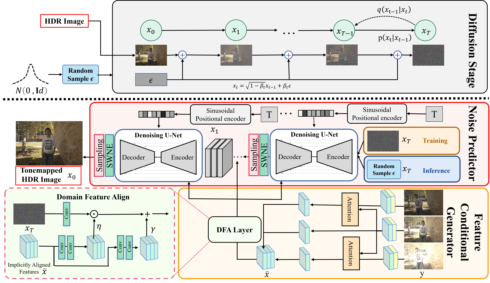

# Towards High-quality HDR Deghosting with Conditional Diffusion Models

This is the implementation for DiffHDR: Towards High-quality HDR Deghosting with Conditional Diffusion Models, [Q Yan](https://scholar.google.com.hk/citations?hl=zh-CN&user=BSGy3foAAAAJ), [T Hu](https://scholar.google.com.hk/citations?user=BNkFUbsAAAAJ&hl=zh-CN), Y Sun, H Tang, [Y Zhu](https://scholar.google.com.hk/citations?hl=zh-CN&user=NEgnwxkAAAAJ), [W Dong](https://scholar.google.com.hk/citations?hl=zh-CN&user=tkTl3BMAAAAJ&view_op=list_works&sortby=pubdate), [L Van Gool](https://scholar.google.com.hk/citations?hl=zh-CN&user=TwMib_QAAAAJ), [Y Zhang](https://scholar.google.com.hk/citations?hl=zh-CN&user=-wzlS7QAAAAJ), in IEEE Transactions on Circuits and Systems for Video Technology, 2021. 
 [[arXiv](https://arxiv.org/abs/2311.00932)]

> **Abstract:** *High Dynamic Range (HDR) images can be recovered from several Low Dynamic Range (LDR) images by existing Deep Neural Networks (DNNs) techniques.
Despite the remarkable progress, DNN-based methods still generate ghosting artifacts when LDR images have saturation and large motion, which hinders potential applications in real-world scenarios.
To address this challenge, we formulate the HDR deghosting problem as an image generation that leverages LDR features as the diffusion model's condition, consisting of the feature condition generator and the noise predictor.
Feature condition generator employs attention and Domain Feature Alignment (DFA) layer to transform the intermediate features to avoid ghosting artifacts. With the learned features as conditions, the noise predictor leverages a stochastic iterative denoising process for diffusion models to generate an HDR image by steering the sampling process. Furthermore, to mitigate semantic confusion caused by the saturation problem of LDR images, we design a sliding window noise estimator to sample smooth noise in a patch-based manner. In addition, an image space loss is proposed to avoid the color distortion of the estimated HDR results. We empirically evaluate our model on benchmark datasets for HDR imaging. The results demonstrate that our approach achieves state-of-the-art performances and well generalization to real-world images.*

## Pipline

The framework of the proposed method. The top figure illustrates the diffusion process, while the bottom figure represents the reverse process, which involves a feature conditional generator and a noise predictor. The feature conditional generator incorporates implicitly aligned LDR features into the noise generator through affine transformation, which guides the model generation.

## Usage

### Environment Preparation
Requirements
* Python 3.9
* PyTorch 1.13
* CUDA 11.7 on Ubuntu 18.04
```
conda env create -n DiffHDR -f environment.txt
```
### Dataset
1. Download the dataset (including the training set and test set) from [Kalantari17's dataset](https://cseweb.ucsd.edu/~viscomp/projects/SIG17HDR/)
2. Please ensure the data structure is as below
```
./data/Training
|--001
|  |--short.tif
|  |--medium.tif
|  |--long.tif
|  |--exposure.txt
|  |--HDRImg.hdr
|--002
...
./data/Test (include 15 scenes from `EXTRA` and `PAPER`)
|--001
|  |--short.tif
|  |--medium.tif
|  |--long.tif
|  |--exposure.txt
|  |--HDRImg.hdr
...
|--015
|  |--short.tif
|  |--medium.tif
|  |--long.tif
|  |--exposure.txt
|  |--HDRImg.hdr
...
```
3. Prepare the cropped training set by running gen_crop_data.py from [HDR-Transformer](https://github.com/liuzhen03/HDR-Transformer-PyTorch) (optional, produces better results compared to random cropping):
```
cd ./dataset
python gen_crop_data.py
```
### Training & Evaluaton

To train the model, run:
```
python train_diffusion.py
```
To evaluate DiffHDR using the pre-trained model checkpoint with the current version of the repository:
```
python eval_diffusion.py --config "hdr.yml" --resume 'Hdr_ddpm3000000.pth.tar'  --sampling_timesteps 25 --grid_r 64
```

You can download pre-trained models from Google Drive
[Pre-trained Models](https://drive.google.com/file/d/1UwmxS20GAzBtU5G6NRJAQADmIyCZPPDE/view?usp=drive_link). 
In addition, we provide inference [results](https://drive.google.com/drive/folders/1jHjhyXkt_0uMhz2BeWBJ7h-YhRGF97r_?usp=sharing) using Pre-trained Models with p=512, r=64, and T=25.

## Reference
If you find this repo useful, please consider citing:
```
@article{yan2023towards,
  title={Towards high-quality HDR deghosting with conditional diffusion models},
  author={Yan, Qingsen and Hu, Tao and Sun, Yuan and Tang, Hao and Zhu, Yu and Dong, Wei and Van Gool, Luc and Zhang, Yanning},
  journal={IEEE Transactions on Circuits and Systems for Video Technology},
  year={2023},
  publisher={IEEE}
}
```
## Acknowledgement
Our work is inspired by the following works and uses parts of their official implementations:
* [WeatherDiffusion](https://github.com/IGITUGraz/WeatherDiffusion)
* [AHDRNet](https://github.com/qingsenyangit/AHDRNet)

Thanks to their great work!
